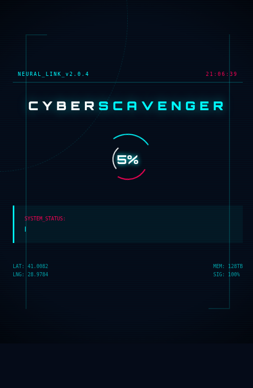
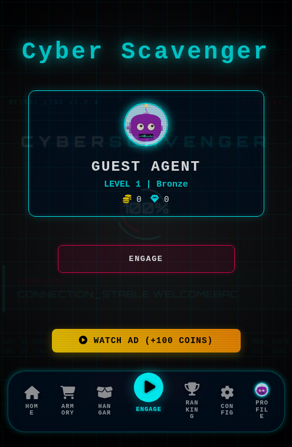

# Cyber Scavenger

Cyber Scavenger is a fast-paced browser action game built with Node.js, Express, MongoDB, and a custom HTML5 canvas front end. The game combines arcade survival combat with persistent progression systems such as score tracking, leagues, inventory, in-game economy, guest accounts, Google sign-in, leaderboards, and an admin-controlled content pipeline.

## Highlights

- Neon cyberpunk presentation with a cinematic system boot intro
- HTML5 canvas gameplay optimized for browser play
- Keyboard and mobile touch controls
- Persistent player progression with levels, XP, leagues, and high scores
- Coin and gem economy with shop and inventory systems
- Guest sessions that can later be converted into permanent accounts
- Global and league-based leaderboards
- Configurable boss rotation and AI-assisted boss generation pipeline
- Admin dashboard for live balancing, item management, user operations, and content moderation

## Screenshots





## Gameplay Overview

The player pilots a cyber ship through a hostile arena filled with enemy waves, projectiles, bosses, collectibles, and temporary power-ups. Each run feeds into persistent progression:

- Score contributes to high score, total score, weekly score, and experience
- Experience increases player level
- Coins earned during runs are deposited into the player's wallet
- League rank is determined from score thresholds
- Boss difficulty scales over time through configurable multipliers

The game supports both anonymous and registered progression paths. Visitors can immediately enter the game as guests, then later convert their session into a full account without losing progress.

## Core Systems

### Player Progression

- High score tracking
- Total score and weekly score accumulation
- Level and experience model
- League tiers: Bronze, Silver, Gold, Diamond, Cyber Legend

### Economy and Inventory

- Persistent wallet with coins and gems
- Item shop with unlockable content
- Equip system for owned cosmetics and upgrades
- Rewarded ad hooks for optional bonus rewards

### Boss Framework

- Configurable boss roster stored in MongoDB
- Dynamic rotation and scaling per boss level
- Support for custom boss logic blueprints
- AI-assisted boss concept generation pipeline with fallback logic

### Authentication

- Local registration and login
- Google OAuth login
- Guest account creation and later conversion to permanent accounts

### Administration

- Dashboard and gameplay balancing controls
- Item management
- Translation management
- User moderation and reset flows
- Cheat and audit logs
- Boss management and AI generation controls

## Tech Stack

- Backend: Node.js, Express
- Database: MongoDB, Mongoose
- Views: EJS
- Auth: Passport, Local Strategy, Google OAuth 2.0
- Sessions: express-session, connect-mongo
- Security middleware: Helmet, rate limiting, CSRF for admin routes
- Frontend: HTML5 Canvas, vanilla JavaScript, modular game scripts

## Project Structure

```text
.
├── config/           # Database and passport configuration
├── controllers/      # Admin controller logic
├── jobs/             # Scheduled jobs / cron setup
├── middleware/       # Auth and activity tracking middleware
├── models/           # MongoDB schemas
├── prompts/          # AI prompt assets for boss generation
├── public/           # Frontend assets, game scripts, images, CSS, APK
├── routes/           # Express routes for auth, game APIs, admin, shop, leaderboard
├── scripts/          # Seeding, maintenance, and backup scripts
├── services/         # AI and application services
├── views/            # EJS templates
└── server.js         # Application entry point
```

## Local Setup

### Requirements

- Node.js 18+
- MongoDB 6+
- A Google OAuth application if Google login is enabled
- Optional Gemini / DeepSeek API keys for AI boss generation

### Installation

```bash
npm install
cp .env.example .env
```

Update `.env` with your local credentials and runtime values.

### Run the Game

```bash
npm start
```

For development:

```bash
npm run dev
```

The application listens on the port defined by `PORT` and binds to `127.0.0.1` by default.

## Environment Variables

The project expects the following variables:

- `PORT`
- `MONGODB_URI`
- `GOOGLE_CLIENT_ID`
- `GOOGLE_CLIENT_SECRET`
- `CALLBACK_URL`
- `SESSION_SECRET`
- `NODE_ENV`
- `GEMINI_API_KEY`
- `GEMINI_API_KEY_BACKUP`
- `DEEPSEEK_API_KEY`

## Security Notes

This public repository intentionally excludes secrets and local deployment material such as:

- `.env` files
- database connection secrets
- OAuth secrets
- API keys
- Android signing keystores
- local logs and backup artifacts

Before deploying your own copy:

1. Generate fresh session secrets.
2. Create your own OAuth credentials.
3. Rotate any previously exposed API keys.
4. Review admin access controls before exposing the dashboard publicly.

### Important Implementation Caveat

The boss blueprint system reconstructs executable client-side logic from stored boss definitions. That is powerful for experimentation, but it also means untrusted boss content should never be accepted without strict validation and sandboxing. If you plan to extend the system for community-generated content, treat this area as security-sensitive.

## Publishing Notes

- This repository is prepared for open-source publication without bundled secrets.
- The APK can be included separately for distribution, but signing materials must remain private.
- If you deploy behind a reverse proxy, keep TLS termination and secure cookie behavior aligned with your `NODE_ENV` setup.

## Scripts

- `npm start` - start the production server
- `npm run dev` - run with nodemon
- `npm run backup` - execute the backup script

## Roadmap Context

The repository contains roadmap and design notes for gameplay systems, admin tooling, and boss AI evolution. These documents are useful for understanding the project's direction, but the running game logic lives primarily in `routes/`, `models/`, `services/`, `public/js/`, and `views/`.

## Contributing

If you plan to contribute:

- keep secrets out of commits
- avoid adding generated or local-only artifacts
- document schema or gameplay balance changes clearly
- test both gameplay and admin-side flows when editing shared systems